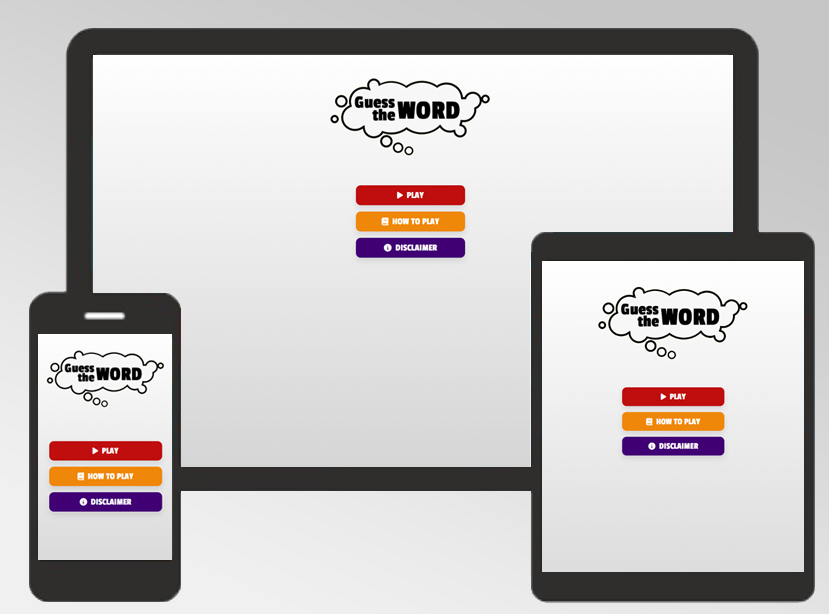
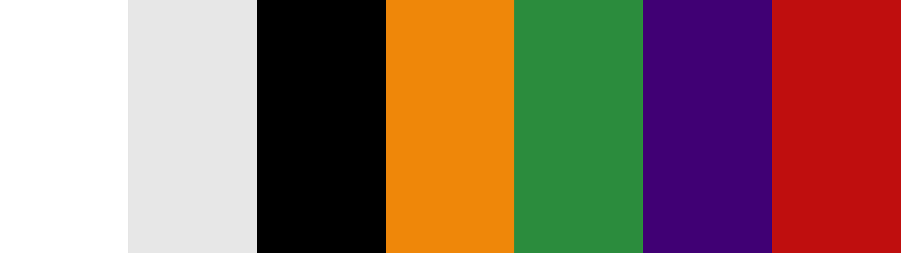
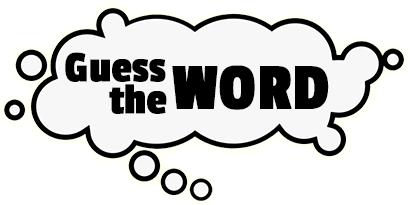
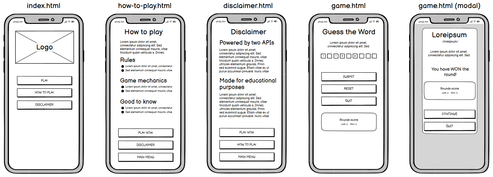
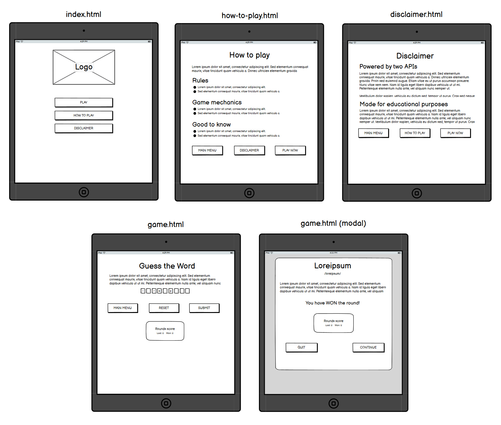
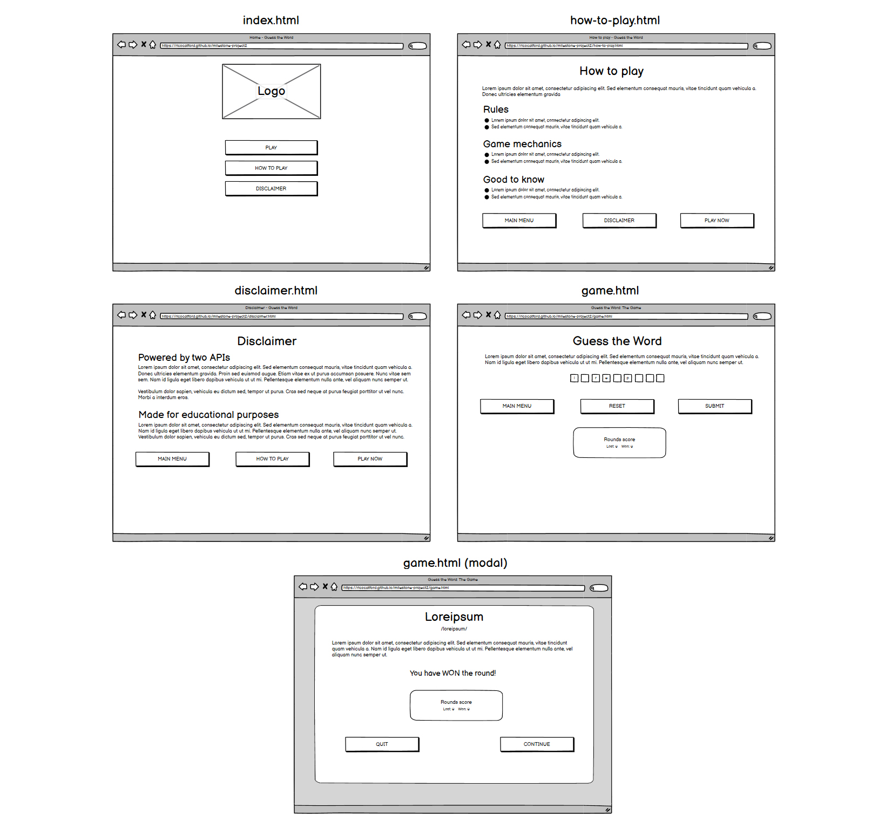

# Guess the Word: The Game

## Table of contents

## 1. Description
Guess the Word is a game where you have the hint of a word and you have to guess the missing characters of the word. I got inspired by childhood game 'Hangman' and also spanish TV show 'Pasapalabra'. The game is powered by two APIs and relies on them to work:
- [Random words API](https://random-word-api.vercel.app/): Used for getting random words.
- [Free dictionary API](https://dictionaryapi.dev/): Used for retrieving word definitions and phonetics.

The purpose of this game is educational, for both: the user and myself. I learned JavaScript writing my first program and also working with APIs. The user can learn a lot too, the game can help with learning new vocabulary, grammar and phonetics.

## 2. Live project
See live project [here](https://ricocatford.github.io/milestone-project2).

## 3. UX
### Design
I decided to keep my design very minimalist and colourful at the same time. 

#### **Colors**
These are the colors I've chosen for my design:

#### **Fonts**
These are the fonts I've chosen for my design, both found on Google Fonts:
- [Poppins](https://fonts.google.com/specimen/Poppins): Used for headings and paragraphs, most of the text content.
- [Passion One](https://fonts.google.com/specimen/Passion+One): Used for logo and buttons.

####  **Icons**
These are the icons I've used for buttons, all found on Font Awesome:
- [House](https://fontawesome.com/icons/house?s=solid&f=classic): Used for 'Main menu' button.
- [Book](https://fontawesome.com/icons/book?s=solid&f=classic): Used for 'How to play' button.
- [Info](https://fontawesome.com/icons/info-circle?s=solid&f=classic): Used for 'Disclaimer' button. Also used for subheading 'Good to know' ('How to play' page).
- [Play](https://fontawesome.com/icons/play?s=solid&f=classic): Used for 'Play' and 'Play now' buttons.
- [Backward Step](https://fontawesome.com/icons/backward-step?s=solid&f=classic): Used for 'Quit' button.
- [Forward Step](https://fontawesome.com/icons/forward-step?s=solid&f=classic): Used for 'Continue' button.

These are the icons I've used for subheadings, all found on Font Awesome:
- [Gavel](https://fontawesome.com/icons/gavel?s=solid&f=classic): Used for subheading 'Rules' ('How to play' page).
- [Gear](https://fontawesome.com/icons/gear?s=solid&f=classic): Used for subheading 'Game mechanics' ('How to play' page).
- [Bolt Lightning](https://fontawesome.com/icons/bolt-lightning?s=solid&f=classic): Used for subheading 'Powered by two APIs' ('Disclaimer' page).
- [Graduation Cap](https://fontawesome.com/icons/graduation-cap?s=solid&f=classic): Used for subheading 'Made for educational purposes' ('Disclaimer' page).

#### **Logo**
I've created my logo using Adobe Photoshop and same font I use for my buttons ([Passion One](https://fonts.google.com/specimen/Passion+One)).

### Wireframes
#### **Mobile view**

#### **Tablet view**

#### **Desktop view**

### User stories
#### **First time users**
As a first time user I would like to see:
- Brief explanation of 'How to play' the game.
- Understand the game at first glance.
- Accessible and responsive UI.

#### **Returning users**
As a returning users I would like to see:
- Different game content, hundreds or thousands of words.
- Words grammar and phonetic.
- New words for my vocabulary.

#### **Website owners**
As an owner I would like to have:
- Disclaimer warning the user where the content comes from.
- Dynamic content. Not always the same words.

## 4. Site Structure
Website/App consists of four pages:
- Home (index.html)
- Game (game.html)
- How to play (how-to-play.html)
- Disclaimer (disclaimer.html)

I've also added a modal (pop up) into game.html which is triggered after user submits game form every round.

## 5. Features
### Current features
- How to play and Disclaimer sections.
- Play now button, which starts the game.
- Words retrieved dynamically through APIs.
- Hint for the word displayed in game and at the end of every round.
- Phonetic of the word displayed (if it's available in the API).
- Indexes generated randomly for every word.
- Score of the game tracked and displayed.
- Pop-up modal when user submits form every round, providing feedback and updated score.

### Future features
- I plan to implement autofocus for inputs for improving accessibility.
- Rounds and time limit (timer and max rounds).
- Difficulty of the game (easy mode would be max 8 characters words, hard mode would be no characters limit).
## 6. Technologies used
### Languages
- HTML5
- CSS3
- JavaScript
- Git

### Frameworks/Libraries
- jQuery

### Software
- Visual Studio Code
- Adobe Photoshop
- Balsamiq

## 7. Installation, Development and Deployment
### Installation and Development
For installation I recommend using your own local environment like I did, using Visual Studio Code, Node.js and Yarn/Vite:
- Clone this repository.
- Open the cloned repository on your preferred IDE (VSC in my case).
- Open terminal and type: ``yarn install`` (this will install all dependencies needed).
- If you want to run it locally you can type in terminal: ``yarn dev``.

### Deployment
For deploying website, I used and recommend you use Github Pages.
- Go to the repository you want to deploy, in this case: the one you just cloned.
- Click on settings menu at the top-right corner of your repository page.
- Scroll down and select 'Pages' section on left navbar.
- Select 'master' branch.
- Click save and this will generate URL for the hosted website (it might take a few minutes to complete it).

## 8. Testing
You can find all the testing [here](https://github.com/ricocatford/milestone-project2/blob/master/TESTING.md).

## 9. Credits
All code found in this project is written by me except these few exceptions:
- Animation for 'floating' Logo image in Home page: This CSS animation was written by Mario Duarte. You can find it [here](https://codepen.io/MarioDesigns/pen/woJgeo).
- Function for generating array of random numbers: This JS snippet helped me with generating random numbers I use for switching display off for some characters later on. I adapted it for my function generateHiddenCharactersIndexes(). You can find it [here](https://stackoverflow.com/questions/2380019/generate-unique-random-numbers-between-1-and-100).
- Modal Pop-up when user submits game form: I used this modal basic example from W3Schools and adapted it. You can find it [here](https://www.w3schools.com/howto/howto_css_modals.asp).