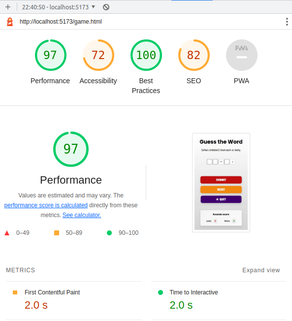
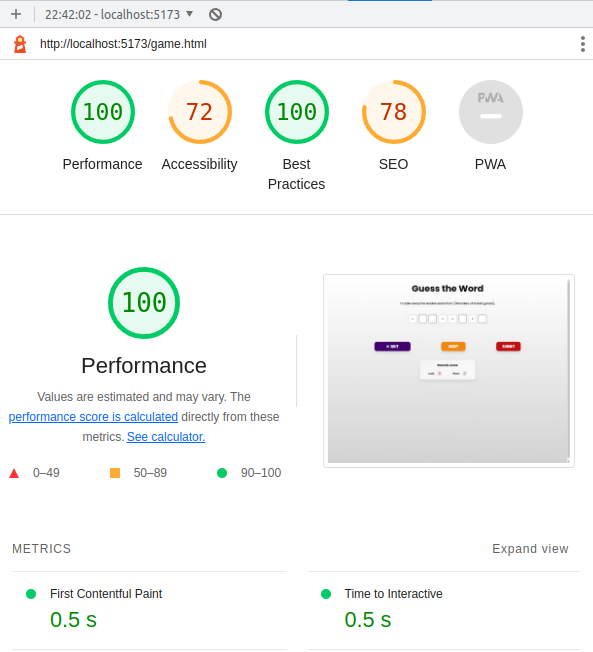
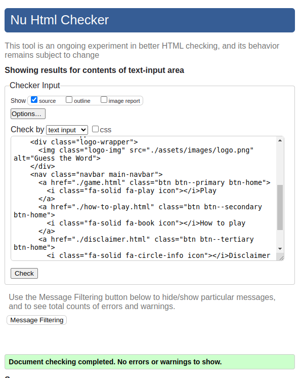
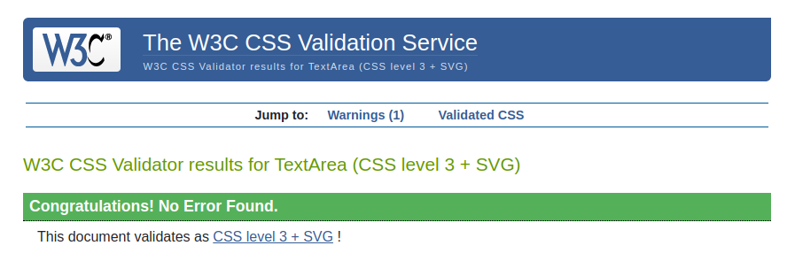
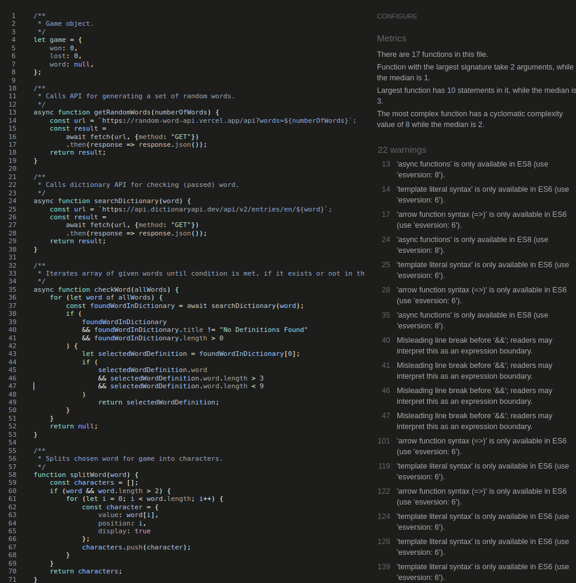

# Testing

## 1. Functionality
I've performed regular tests through out development for the usability and performance of the game. Played the game several times (more than 100 rounds) and manually tested hundreds times to see how APIs would respond to this 'flood'. No problems found with it.

I also tested responsive design and performance for different browsers including all OS (Windows, Mac and Linux) without any major problems found, in the following browsers:
- Chrome
- Microsoft Edge
- Firefox
- Safari

## 2. Performance
I used Lighthouse extension for Chrome developer tools for testing the performance of the website/game:

### Mobile devices

### Desktop devices

## 3. Code validation
### HTML validator
Tested all the HTML code with [W3C markup validator](https://validator.w3.org/) and no errors or warnings found:

### CSS validator
Tested all the CSS code with [W3C jigsaw validator](https://jigsaw.w3.org/css-validator/) and no errors found, only one warning for ``@import`` on line 1:

### JS validator
Tested all the JS code with [JSHint](https://jshint.com/) and no errors found, only some warnings regarding ES6/ES8 notation:

## 4. Bug fixes
- While developing the game I found one major bug when submitting game form every round, where it was reloading the whole page including the script, resetting lost and won score to 0. Fixed it in line 147 of game.js with ``event.preventDefault();``.